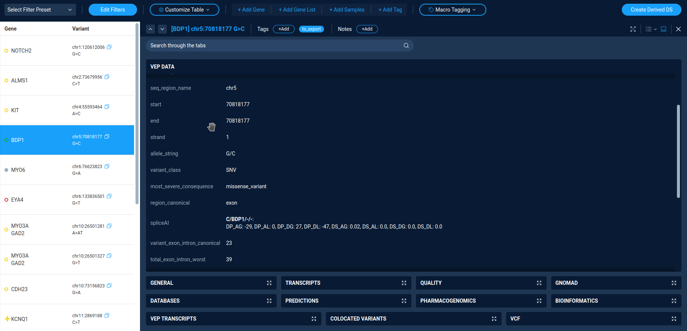

.. _analysis_examples:

*****************
Analysis examples
*****************

Here are a couple of examples of variation analysis using AnFiSA capabilities.

At the time of the publication
(`AnFiSA: An open-source computational platform for the analysis
of sequencing data for rare genetic disease <https://www.sciencedirect.com/science/article/abs/pii/S153204642200185X>`_),
a demo instance of the platform is available for use here:
https://app.demo.forome.org/.
The "Ashkenazi Trio" high-confidence benchmarks provided by NIST is available on the demo platform.”

Alternatively, one can use a self-hosted Anfisa installation with sample data.

Phenotype-based analysis (looking for potential hearing loss variants)
======================================================================
A sample workflow for hearing loss can be illustrated using a demo dataset derived from the “Genome in a Bottle”
Ashkenazi trio NIST v4.2.
Because we are using public data, the proband has normal hearing,
so the following workflow is for illustration purposes only.
A user can either create a derived dataset by applying the “Hearing Loss v.5” decision tree
or by using a prebuilt dataset named PGP3140_Hearing_Loss_Variants.

The dataset contains 41 variants. Inside the dataset, the user first applies the “Hearing Loss Quick Filter”,
which implements the logic based on the selection of individual transcripts
to further reduce the number of variants to 24. The filter itself can be examined in the Decision Tree Panel.
Apart from the variants found in the proband, the 24 variants include the carrier variants found only in parents.
The user should exclude those variants by selecting “proband” in the “Sample” drop-down menu.
That leaves 8 variants. The user then reviews these variants manually.

The first variant is chr4:54727298 A>C in KIT (Figure SF4).
It is included in the dataset because it has the “DM” tag in HGMD.
However, it is a common variant in the Ashkenazi Jewish population to which the proband belongs
and is annotated as “Benign” in ClinVar. A clinician would likely exclude this variant from consideration.
In Anfisa, this is done by tagging a variant as “Likely Benign” and leaving a corresponding note.

The next variant is chr5:71522350 G>C in BDP1. This one is more suspicious, because it is rare,
though it is about 20 times more common in Ashkenazi Jews than in other populations
and is not present in ClinVar or other databases.

It is predicted to possibly cause a splice acceptor gain by the SpliceAI tool.
It is a heterozygous variant in a gene associated with autosomal recessive hearing loss
and inherited from the proband’s mother, and as such is unlikely to cause hearing loss.
This can be tagged for further review by the user.

The next KCNQ1 variant chr11:2847958 C>T and the last variant in JAG should be categorized like the KIT one.
The rest are extremely rare variants without clear clinical annotations.
A user might want to look at the transcripts tab to categorize them.
The transcripts that served as a base for selecting variants are shown in bold.
If the user checks the “Show Selection Only” checkbox, then all other transcripts become hidden.

Genetics first/Phenotype agnostic analysis
==========================================
Anfisa includes two built-in decision trees which illustrate the Genetics-first approach:
BGM Red Button (BGMRB) and BGM Research (BGMR).
The BGMRB decision tree generates a subset of relatively high-quality variants,
for which there are at least some reasons to suspect that they might be causal for a genetic defect.
The BGMR decision tree is a superset of BGMRB that includes auxiliary variants which,
while there is no known evidence of them being causative, there is no evidence to the contrary either,
as well as variants with poorer call quality.

We first review the PGP3140_BGM_RedButton data set created by the application of BGMRB.
The X-chromosome variants are not identified in the publicly available dataset;
hence the X-linked inheritance mode is not applicable in this example.
Therefore, we only review the autosomal dominant and recessive inheritance modes.
Selecting the Mendelian_Auto_Dom filter yields no variant either.
It is understandable given the nature of the dataset: autosomal dominant variants usually require
either running dedicated de-novo callers or more than just 3 relatives included in the Variant Call Format file.
In this dataset, however, we only have a simple trio.

Recessive analysis falls into two categories: homozygous and compound heterozygous.
Selecting the Mendelian_Homozygous_Recessive quick filter yields 6 variants in 5 genes,
5 missense, and 1 in-frame insertion. All missense variants have mostly benign in-silico predictions
and are not found in ClinVar.
Detailed in-silico predictions can be examined in the Transcripts tab,
where transcripts that served as the basis for the inclusion of the variants in the list are shown in bold.
By checking the “Show Selection Only” checkbox, the user can view only predictions relevant to the inclusion criteria.
Selecting the Mendelian_Compound_Het filter displays a list of 7 compound heterozygous variants in 3 genes.
They can be reviewed in the same way as the homozygous variants.
Scrolling through the list with the open Quality tab provides detailed information about the alleles.

To get a better feel for how the filters are constructed, a user can click on the Conditions menu,
click on the Filters button, then select Load and select one of the filters discussed above.
Now the user can modify the filter by adjusting its options.

:ref:`toc`