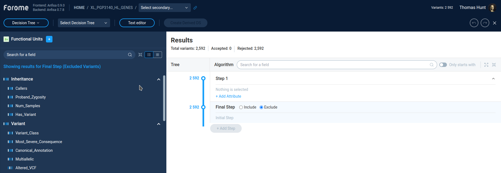
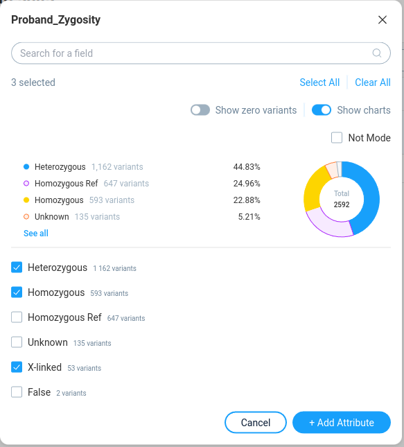
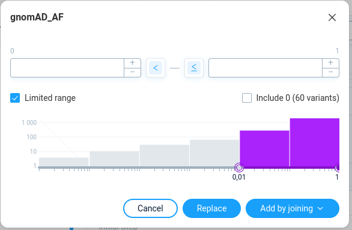
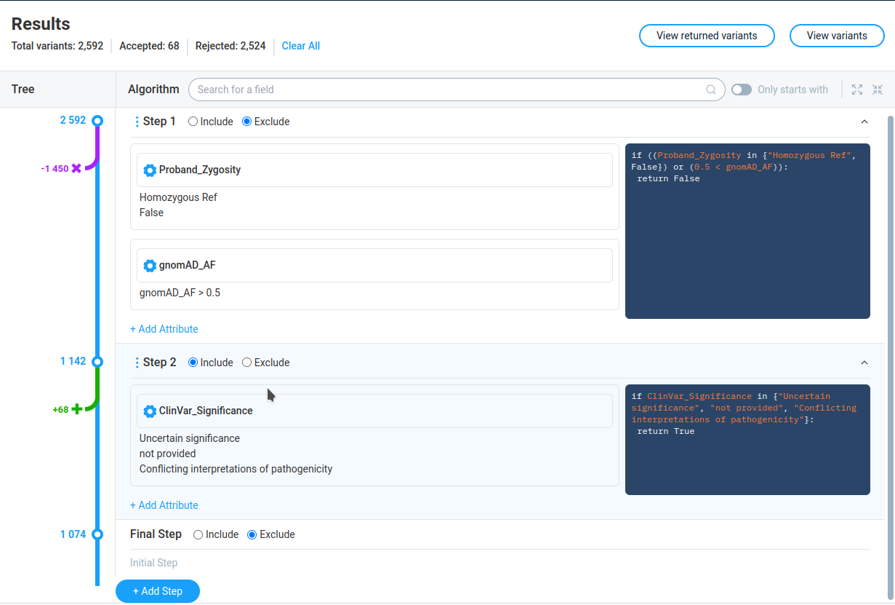
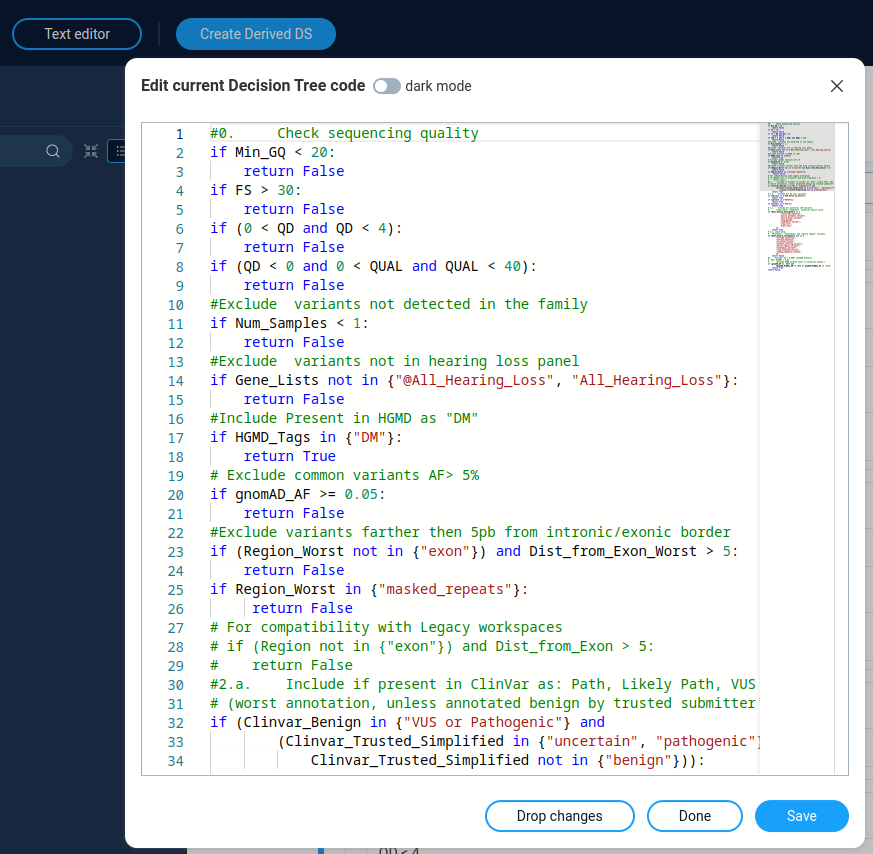

.. _decision_tree:

*************
Decision Tree
*************

The Decision tree is an advanced method of variations filtering.
It allows very powerful and flexible way to refine variations set and create new derives sets.

How Decision Tree works
=======================
On the first glance, the Decision Tree is very similar to **Filter Refiner** functionality.
This is a sequence of a filtering steps, each of them filters variation by the specific condition,
or group of conditions.

Each filter separates variations in two groups:

* Variations which pass filter
* Variations which not pass filter

However, the **Filter Refiner** has very straightforward hardcoded logic:

* Variations, *not passing* the filter are *excluded* from the analysis
* Variations, *passing* the filter goes to subsequent filters

In **Decision tree** we have more flexible options both in variation filtering and in subsequent actions.
The overall logic is following:

* A Decision Tree consists of a sequence of steps (branching points).
* The process starts with a set consisting of all of the variants from the dataset.
* This set "travels" through a tree trunk.
* Every step is a particular filter or a combination of filters joined by AND/OR
  (In decision tree they are referred as *attributes*).
* At each step all variations are separated in two groups
    * Variations, *not matching* the step criteria goes to subsequent steps.
    * For variations, *matching* step criteria user can choose one of the following actions:
        * Unconditionally include variations in the final selection
        * Exclude variations from further consideration (throw away)

A result of the application of any **Decision Tree** is a set that we will call "Final selection".

At the final step of decision tree we can decide what to do with rest of variations:
add in to the final selection or throw away.

In fact, the **Filter Refiner** is just a simple version of a decision tree,
where at each step we exclude variations, not passing the filter,
and on the final step including all variations to final data set.

Decision tree interface usage
=============================
To start variations filtering by Decision Tree* user should select **Whole genome/exome** and then
**Build inclusion/exclusion criteria** option.
After this, the Decision tree window opens.
Alternatively, user can switch between **Decision tree** and **Filter Refiner** modes
by the combo box, next to Forome logo.

Header panel
--------------
On the top of the page there is a panel containing controls for working with presets and datasets.
From it user can:
* Select decision tree from the list of pre-defined trees
* **Create a decision tree**  -- save current tree as a new preset
* **Text editor** -- edit decision tree code
* **Create derived dataset** -- apply decision tree to the dataset and save results as a derived dataset.

AnFiSA is distributed together with the set of pre-defined decision trees.
The detailed description of these trees are located in the separate section.

Filters panel
-------------

On the left panel user can see the list of the filters, same as for **Filter Refiner**.

By clicking on the filter user can see the filter properties in the pop-up window.

On the right **Results** panel user can see the current decision tree.
User can select the step by clicking on the step caption.
By default the decision tree contains only one step.

After pressing the *Add attribute* button the filter is added
to the current step.
Here an *Attribute* is just one filter in the particular step.

User can add more filters to the same step by clicking on the other filters in the left panel
or by pressing the **Add attribute** button on the **Results** panel (see below).

The filter popup for new filter will looks the same except of action buttons.

For adding a filter to the step with existing filter one will have the following options:
* Replace -- replace current filter in the step to the new one
* Add by joining -- add a filter as a new attribute to the step.

In the second case user must select the joining function: OR/AND

Decision tree panel (Results)
-----------------------------
The **Results** panel contains active decision tree filters.
On the first glance it can look complicated, however underlying logic is rather straightforward.

On top of the page none can see the statistic on the current decision tree:
Total number of variations, number of accepted and rejected variations,
and two buttons to view results:

* View returned variations - variations passing decision tree
* View variations - all list of variations

The **Tree** column shows graphical tree with the list of tree steps.
At the each step AnFiSa displays the number of variations before step.
The arrow indicates number of variations which are included in the final dataset
(green arrow) or excluded from subsequent analysis (purple arrow).

The **Algorithm** column shows the step details for each step.

The **Include/Exclude** radio buttons define action for variations passing filter:
include into final dataset or exclude from the calculation.

The icon "three vertical dots" allows to change decision tree:
* Add steps before/after current
* Negate the step -- reverse the final result of step
* Duplicate step
* Split step -- separate multi-attribute step to the several independent steps
* Delete step

The left part of step details shows the filters (attributes) with their settings.
The right part contains the same information in form of Python-like language.

The gear icon in the filter allows user to configure the filter parameters.
The configuration window is the same as for adding new filter to the step.
User can save updated filter parameters, cancel changed or remove the filter form the step.

The right part of the step shows the python-like code describing the step.

The "**Add step**" button at the bottom of the tree adds mode step to the decision tree.

The bottom of the tree always occupied by the special step called "**Final Step**"
The only purpose of this step is to decide, what we should do with te rest of variations,
not included/excluded by other filters. Here we have only two possible options:
include these variation to the final dataset, or exclude.

Code editor
-----------
User can directory edit the decision tree code by clicking the "Text editor" button on top of the decision tree window.
The code syntax for decision tree is described in :ref:`decision_tree_syntax`.

After clicking the "Save" button decision tree update according to the code changes.
The "Done" button allows to save changes in code without direct updating the decision tree.

**Next**: :ref:`filter_dashboard`

:ref:`toc`