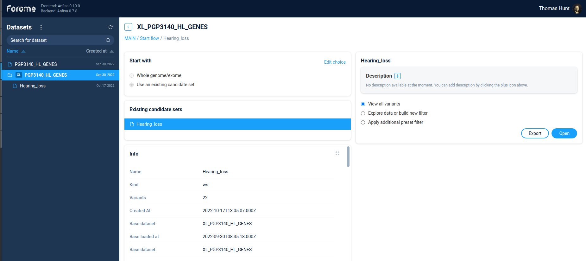
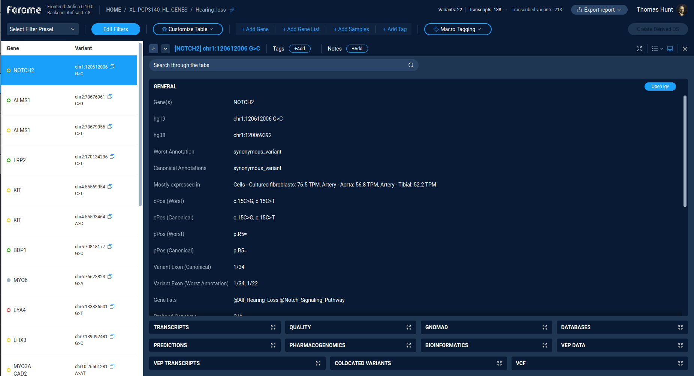
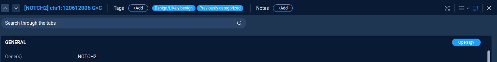

.. _derived_dataset:

***************
Derived Dataset
***************

Derived dataset selection
=========================

To open derived dataset, just select one of the primary datasets,
the select option "Use existing candidate set".
After selecting the candidate set one will see all the information regarding the selected set:
the general information, annotation sources, and code of decision tree/filters used to produce this dataset

On the right panel one can add dataset description and decide, what to do with the dataset.
One can continue to filter variations by Filter refiner/decision tree.
Alternatively, if the dataset is small enough, one can directly view variations
by selecting the option "View all variants".

Variations table
================

The main screen of the derived dataset exploration is the variations table.

The left part of the screen contains the list of all variations in the dataset,
including gene name and exact variation description. The right part of the screen contains the detailed
description of the selected variation.

Table controls
--------------

The action "**Edit filters**" switches interface to variations filtering via filter refiner
or decision tree.
The "Filter refiner" and "Decision tree" functionality works the same way both for primary and for derived datasets.

The actions "**Select filter preset**" is used to perform a quick filtering of variations.
One can choose from the list of previously saved filter presets.

Actions "**Add gene**", "**Add gene list**", "**Add samples**", "**Add tags**" are used to set additional quick filters
by the corresponding properties. One can use this quick filters to narrow down variations list.

Variants list and classification
--------------------------------

The left part of the screen contains the list of all variations, according to the current filter settings.
By default, the table contains the gene symbol and the variant notation.
By clicking on the variation, one can see the variation details in the right panel.

The color and symbol on the variation record indicates the result of the semi-automated variant classification
based on a transparent decision model.

Visual labels represent the variant functional impact:

* Crosses for variants leading to loss-of-function
* Circles for the variants which do not implicitly disrupt function of the protein coding genes

The pathogenicity of the variants is coded by color:

* Benign variants are colored green,
* However, in case of loss-of-function, benign variants are colored yellow
  despite being classified as not damaging due to nature of the variant consequence.
* Variants of uncertain significance are colored yellow,
* Pathogenic variants are colored red.
* Sequence variants which are not listed in HGMD and ClinVar and do not have in-silico predictions
  are displayed as gray circles.

More detailed description of variant classification algorithm is here: :ref:`variants_classification_algorithm`

Variation details
=================
The right panel of the screen contains the details of the selected variation.
Buttons on the top of the details page controls the variation selection and tagging.
One can choose variations by pressing Up/Down buttons, and add tag and text notes for the variation.

Variations tagging
------------------
To add the variations tag just press the "**Add tag**" button. Here one can select tag from list of
pre-defined tags or create a custom tag.
All assigned tags are shown next to the "**Add tag**" button.

Variation properties
--------------------
All variation properties are separated in several groups. One property group (*"General"* by default)
is expanded and its content is visible.
Other groups are collapsed and presented on bottom of the right panel.
One can switch between groups by clicking on the group name.

For expanded group user can see all properties of the selected variation.
All properties are not editable. However, for some groups there are interactive links to external resources.
For example, "**Open IGV**" for "**General**" group and "**gnomAD browser**" for gnomAD group.

At each step user can export the resulting variations table to Excel/CSV file using
**Export report** function (Located on top of the screen next to user picture).

Exporting data
==============

Anfisa supports several ways of exporting selected variants.

To export selected variants as a Microsoft Excel Workbook, the user should use "Export report" button
next to the user picture.
Anfisa exports variations according to the current filtering settings.

To export data in Excel document AnFiSA uses a template Excel table.
A template defines what properties of the variant are exported, in what order they are exported,
and what colors/styles are used for specific columns.
Default package includes template used for SEQaBOO project.

Variants can be also exported as a simple tab-delimited file.
By default, only gene name and variant notations are included as two columns in the file.
This option can be customized for a specific installation by modifying the `solutions.py` module.

**Next**: :ref:`analysis_examples`

:ref:`toc`

