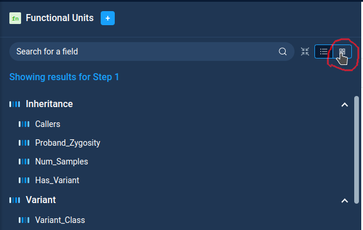
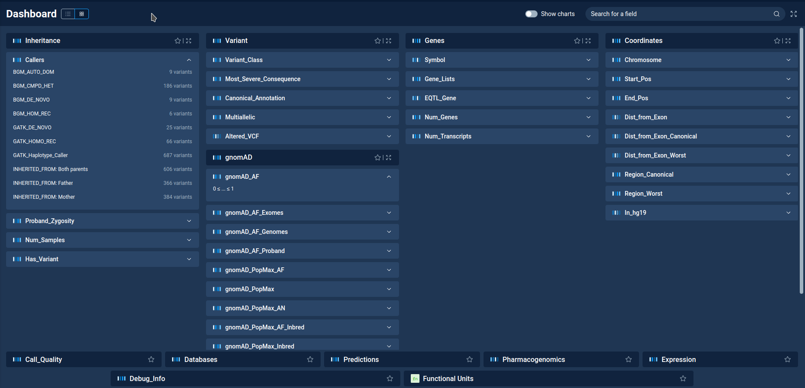
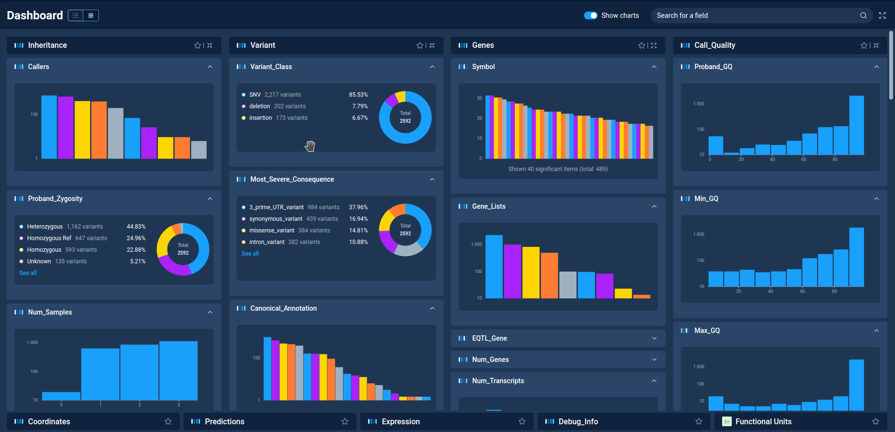

.. _filter_dashboard:

****************
Filter dashboard
****************

**Filter dashboard** is a special view in Anfisa, allowing to see all filters in one place.

One can switch to the dashboard view both from **Filter refiner** and **Decision Tree** pages
using the dashboard mode on the filter tab.

On the dashboard window, one can see all available filter categories (Inheritance, Variant, Genes, etc.)
On the bottom part of the screen, there are "collapsed" categories, where all individual filters are not seen.

The search entry on top of the window allows to search filters by name.

By clicking on the filter category header one can "expand" it.
The expanded categories are moved on top of the screen. For them one can see the list of individual filters.
By clicking on the filter one can expand it and see the filter details: categories for categorical filters
and the value range for numeric ones.

One can select favorite filter categories by using "star" icon next to category name.
Favorite categories are always shown on top of the screen.

By clicking on the filter details one can open the popup with filter settings. One can edit filter properties
and add filter to filter refiner or decision tree.

On top of the Dashboard window there is the "**Show charts**" switcher.
By enabling it one can see charts for all filters from "expanded" filter categories.
Each chart can be collapsed/expanded by the arrow button in the top right corner of the chart.

**Next**: :ref:`derived_dataset`

:ref:`toc`