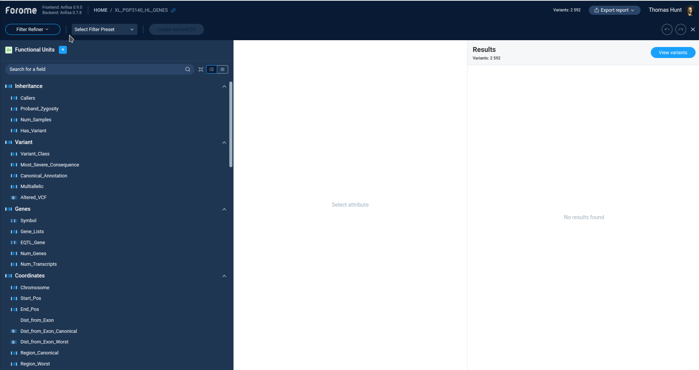
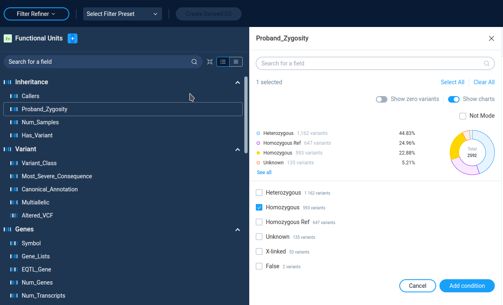
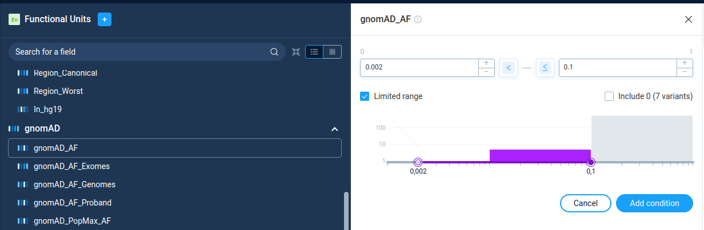
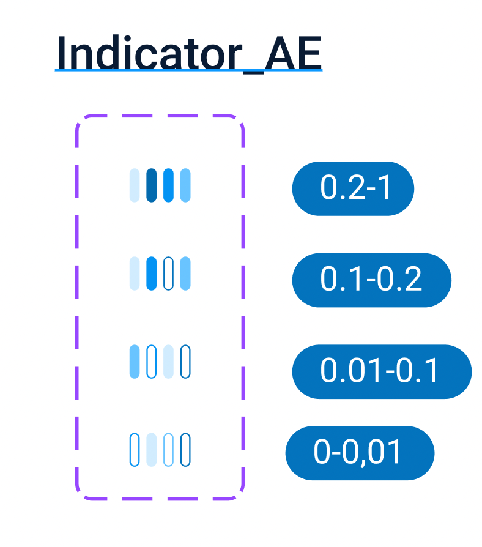
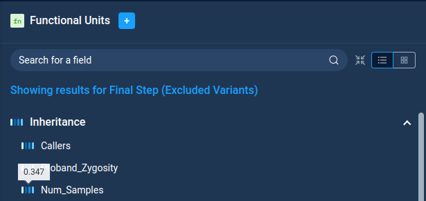
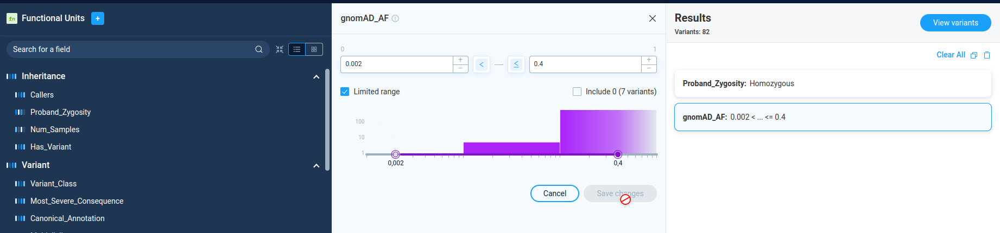
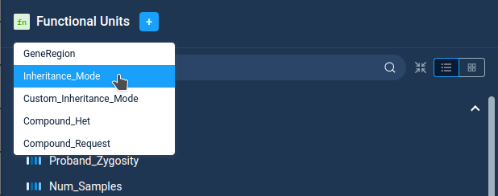
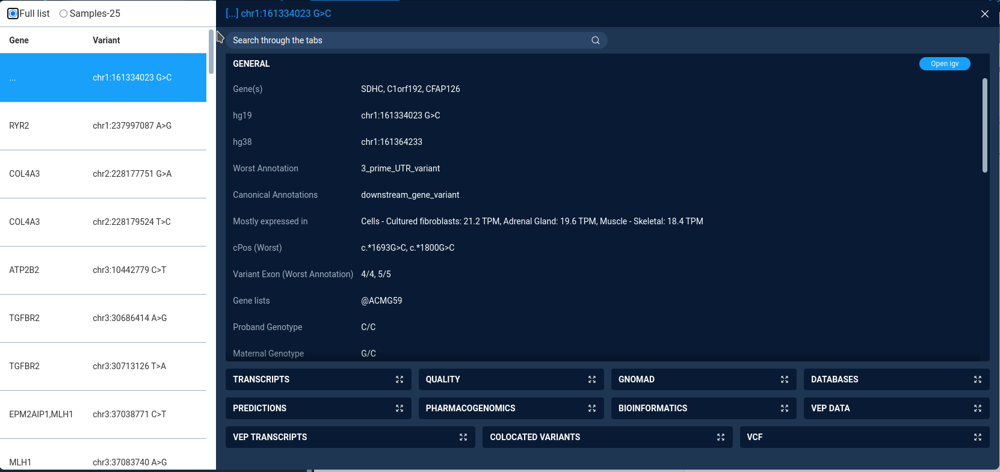
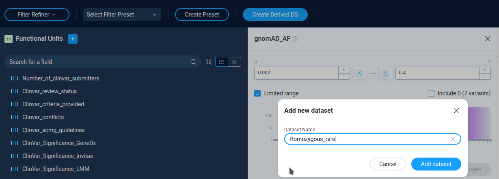

.. _filter_refiner:

**************
Filter refiner
**************

To start variations filtering by *Filter refiner* user should select **Whole genome/exome** and then
**Explore data or build new filter** option.
After this, the filter refiner window opens.

Main Filter refiner window
==========================
The caption of the **Filter Refiner** window contains the set of controls.
The left one displays the work mode: **Filter Refiner**.
Next to it user can select and create filter presets.
Finally, user can create a derived dataset for filtered ones.

Filters
=======
Below the caption string there is a list of available filters.

The Anfisa provides for the user the large set of available filters for almost all
variation properties in initial VCF file.
By clicking on the each filter user can see the filter settings and details.

All list of available filters with descriptions are available here:
:ref:`func_ref`

By operation mode all filters can be divided into two groups:

* Categorical
* Numeric

Categorical filters
-------------------
Categorical data entries are presented by list of filtering categories.
On the filter details page AnFiSA shows histogram or pie chart of categories distribution.
User can select/deselect categories from the list.

Only variants from selected categories will go to subsequent analysis.
The **Not Mode** inverts the variations selection.

Numeric filters
-------------------
The numeric filters allows user to filter variations by the value of some numerical parameter.
On the filter details page AnFiSA shows histogram of value distribution.
The distribution histogram is displayed in linear or logarithmic scale.
The display mode is pre-configured for filter and can't be changed by user.

User can select value range to pass visually on the histogram or by typing the numeric values,
or by clicking on the histogram.
The buttons "<" and "<=" next to data entry edits controls incluson/exclusion of the border values.

The checkbox "**Limited range**" next to range selection forces user to choose parameter boundaries
only inside the real parameter range for current data set.
This option is select by default.
For individual dataset analysis there is no sense in unchecking this option.
However, for building preset to process different data sets, user can unselect this checkbox
and have more flexibility in region selection.

Each numeric filter passes variations with the parameter value *inside* the specified range.
In **Filter Refiner** mode there is no way to select variations *outside* the selected range.
To do this, one can use **Decision tree**.

Filter discriminative power
---------------------------
In the context of Anfisa application there is a wide list of variant properties that can be used to reduce the number
the set of selected variants.
The **Discriminative Power** value is a special number used to help the user to notice the most “effective” properties
from a long list.

Here “Effectivity” of a filter means that with use of it one can split the current set of variants
on the the most strongly differing groups (e.g. with loss maximum of “entropy”).
So, the Discriminative Power in this context pure informational effectiveness,
with no concerns of property meanings.
The "effective" filter can separate variations into most differing groups, but this differentiation
can have no real biological meaning.

The algorithm of discriminative power calculation is described here:
:ref:`discriminative_power`

The visualization of this “effectivity” is an indicator with a choice of 3 or 4 colors
close to the name of each filter. Each interval of discriminative power value has its own color coding,
representing the number of different groups and number of variations in each group.
This is a rough tool, however it might be helpful in work with a wide list of variants and filters.

To see the exact value of discriminative power one can hover a mouse over the filter discriminative power indicator.

Filter chain creation
=====================
After setting filtering options for the filter user applies it by pressing the **Add condition** button
on th filter details page.
After pressing this button, new filter will be added to the list of filters on the right panel **Results**.

User can continue filtering process by adding new filters to the list.
Anfisa allows to apply to a dataset combinations of filters,
and each additional filter operates on the result output of the previous filtering.
The consequent application of different filters results only in conjunctions of the conditions.

On the **Results** panel user can see all active filters, view and change filter settings.
After filter settings change user need to press **Save changes** button to apply it.
User can continue refinement process and add new filter to narrow the variations set.

Also AnFiSA displays the number of variants passing filter chain next to the panel caption:
"*Variants: 837*"

User can delete an active filter by selecting pit and pressing the "Garbage bin" icon
on the right of the **Results** panel.
Or user can delete al filters by pressing the **Clear All** button.

Filtering chain functioning notes
---------------------------------
Each new filter is applied to the **already filtered** variations set.
Therefore adding each new filter will lead to narrowing of the variation set.
To achieve more flexible filtering one should use **Decision tree** capability.

All charts in the filter details panel also displays the statistics for variations filed by previous filters,
no for original variations set.

Functional Units (Filtering functions)
======================================

The **Functional units** (filtering functions) are specific types of filtering actions.

From the user point of view they are very similar to "ordinary" filters.
The difference is that "ordinary" filters use only data fields already present in the dataset.
They utilise standard functionality of OLAP database and works very fast even on large sets of data.
Also, all "regular" filters are commutative:
they can be applied in any order and will produce the same result.
This is the requirement of OLAP data analysis platform.

Filtering functions  perform some calculations to filter data which has to be done interactively
and can't be precalculated in advance. They are not commutative and recommended to appy
only after narrowing down the dataset size by "ordinary" filters

Functional units are accessible via specific popup on top of the filter list.
For now AnFiSA implements only five functions.

Functional units requires proper settings to work, which can be complicated in case of complex functions.
Most part of currently implemented functions are associated with zygosity calculations
and described in the separate section :ref:`zygosity_notes`.

Full description of functional units with required parameters is here: :ref:`func_ref`
The description of filtering functions scientific applications can be found in
`AnFiSA paper <https://www.sciencedirect.com/science/article/abs/pii/S153204642200185X>`_

Data size for filtering functions
---------------------------------
Most part of complex filtering functions (for example *Compound_Request()*) produce proper result
only for valuable size of input data set.
If input data contain to much variations the filtering results will not have
any sense from scientific point of view. In this case AnFiSA stops calculation and returns an error message.
This prevents user from making methodological errors in formally correct analysis.

**The error message regarding too large data size is not just a technical limitation.
In most cases it means that your results does not have a sense from scientific point of view.**

The same logic works for several other types of analysis and filtering, and even for visual representation of the data.

Presets
=======
User can save a created set of filters by pressing the **Create preset** button.
User should provide the preset name and optionally assign a solution pack -- the group of presets.
To load a preset, user just needs to select a preset in a combo-box on the **Filter Refiner** caption.

The list of all available filter presets can be found here:
:ref:`predefined_filters`

Viewing and saving filtration result
====================================
At the each step of data processing user can view the filtering results by pressing the
**View variants** button next to **Results** panel caption.
AnFiSA displays the variations table in a new modal window.
The button is active only if there are
not more than 10000 variations in results.

The variation view window is in fact a limited version of the variation view table,
available for secondary datasets.
It is designed to be lightweight and fast, therefore it has only a limited set of functions.

The left part of the window contains table with all variations and genes, affected by the variation.

The combobox on top of the variations table defines the variations view mode:

* *Samples-25* - display 25 randomly selected variations. Selected by default
* *Full list* - display all variations. Available only is filtered set contains less than 300 variations.

The right part of the window displays the detailed data for selected variations.
The variation properties are grouped by type in the collapsed boxes. User can expand any box by clicking on it.

Creating a derived data set
===========================
User can save the resulting set of the variations as a derived dataset by pressing the **Create Derived DS** button
and providing dataset name. The derived datasets are described in the corresponding section of the manual.

After creating a derived dataset user can open derived dataset, or continue refining data.

**Next**: :ref:`decision_tree`

:ref:`toc`

