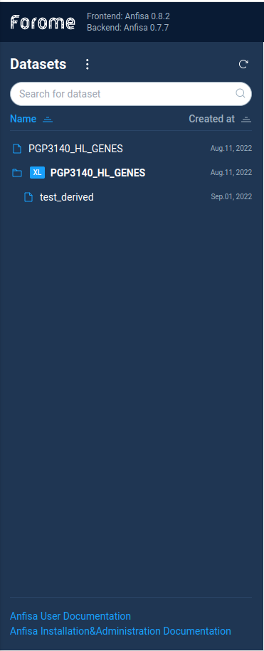
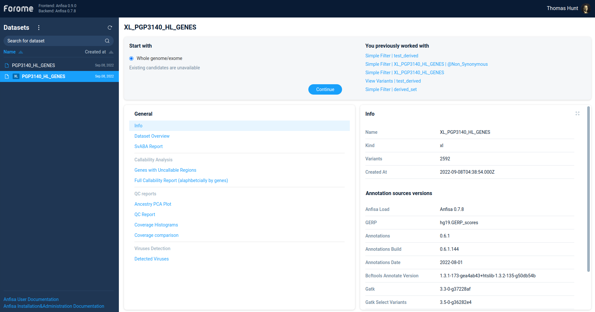
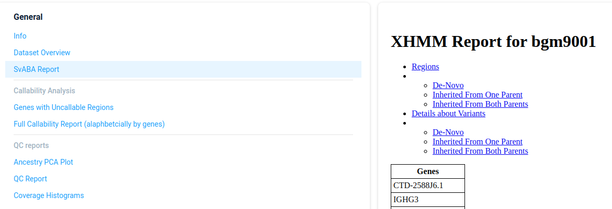
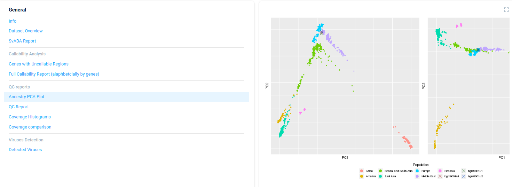

*********
Workspace
*********

To access the main Anfisa screen just open the AnFiSA UI in browser.
By default after installation the UI is available on http://localhost:3000

Datasets tree
=============
All data regarding variations are represented as **datasets**.
Each dataset is the set of variations for one or multiple samples.

The Anfisa Datasets are defined in two main groups:

* **Primary**, or XL datasets.
* **Secondary**, or derived datasets.

Primary datasets usually represent full exome/genome variations set of several experimental samples.
It can contain several millions or even billions of variations.
User can filter and process data from primary datasets but can't view the variations directly.

The secondary datasets are the result of filtering variations from primary datasets.
Each secondary dataset is a descendant of ancestor XL dataset.
The secondary dataset can include not more than 10000 variations.
User can do with secondary dataset all filtering operations same as for XL datasets.
In addition, user can directly view the list of the variations in a secondary dataset.

To start work with Anfisa user should select the primary dataset.

**Note**: the derived datasets can't be selected directly. User need to open it via
primary dataset.

Primary dataset info
====================

After selecting the primary dataset user can see the dataset information page:

Each sections in the left tab contains some set of the information which is displayed in the right tab.
The information can be presented as a plain text, tables, links, etc

Here is the brief description of the available sections:

* General
    * Info
    * Dataset Overview
    * SvABA Report
* Callability Analysis
    * Genes with Uncallable Regions
    * Full Callability Report (alaphbetcially by genes)
* QC reports
    * Ancestry PCA Plot
    * QC Report
    * Coverage Histograms
    * Coverage comparison
* Viruses Detection
    * Detected Viruses

Here is the brief description of info sections:

Info
----

SvABA Report
------------

Ancestry PCA Plot
-----------------

Primary dataset analysis
========================
To start analysis for primary data set user should select the **Start with** and choose option **Whole genome/exome**.
After this user will see the possible list of filtering options in the **What's next?** panel.

For custom data filtering AnFiSA supports two very powerful methods, which are described in
subsequent sections:

* Filter refiner
* Decision tree

Also the **What's next?** panel contains several build-in analysis types
(ACMG analysis, Phenotype based analysis), which will be described later.

